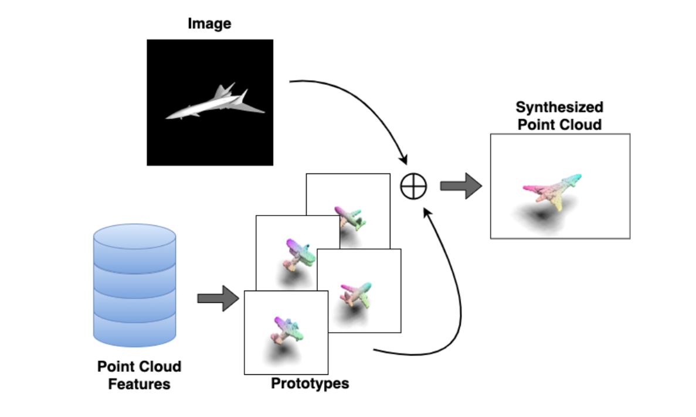
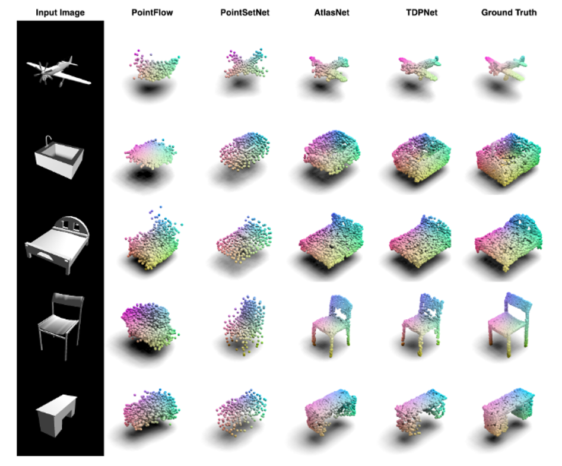
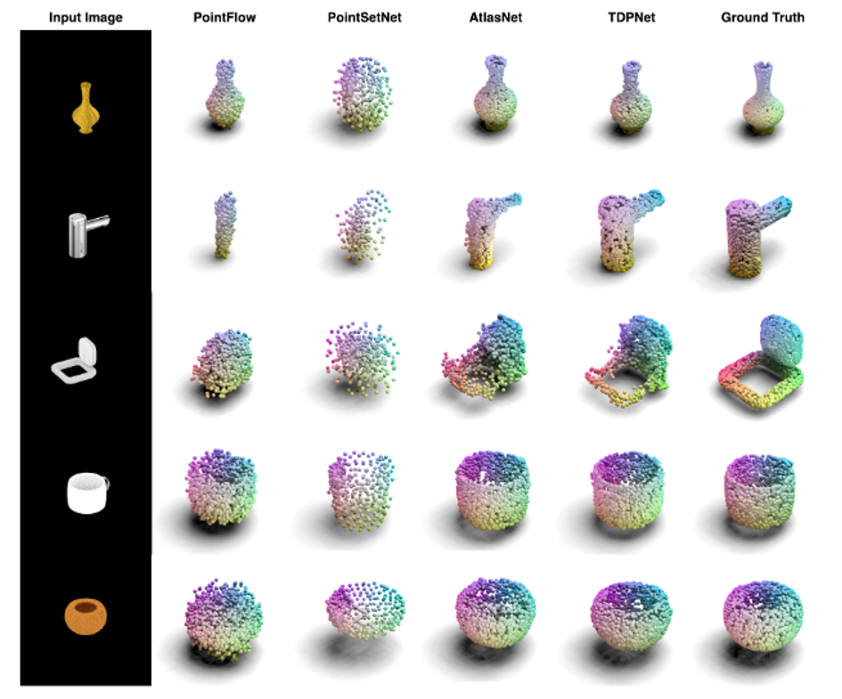

# TDPNet: Single View Point Cloud Generation via Unified 3D Prototype

This repository contains the PyTorch implementation of the paper:

[**Single View Point Cloud Generation via Unified 3D Prototype**](). <br>
Yu Lin, Yigong Wang, Yifan Li, Yang Gao, Zhuoyi Wang, Latifur Khan <br>
In [AAAI 2021](https://aaai.org/Conferences/AAAI-21/)

## Introduction
In this project, we are focusing on the point cloud reconstruction from a single image using prior 3D shape information, we called it 3D prototype. Previous methods usually consider 2D information only, or treat 2D information and 3D information equally. However, 3D information are more informative and should be utilized during the reconstruction process. Our solution is that we pre-compute a set of 3D prototype features from a point cloud dataset and infuse them with the incoming image features. We also designed a hierarchical point cloud decoder that treat each prototype separately. Empirically, we show that TDPNet achieves SOTA performance in point cloud single view reconstruction. We additionally found that a good quantitative results does not guarantee a good visual result.

## Intuition



## Getting Started
### Installation

1. Clone this repo:
```
git clone https://github.com/voidstrike/TDPNet.git
```

2. Install the dependencies:
* Python 3.6
* CUDA 11.0
* G++ or GCC5
* [PyTorch](http://pytorch.org/). Codes are tested with version 1.2.0
* [Scikit-learn](https://scikit-learn.org/stable/index.html) 0.24.0
* [Pymesh](https://github.com/PyMesh/PyMesh) 1.0.2

3. Compile CUDA kernel for CD/EMD loss
```
cd src/metrics/pytorch_structural_losses/
make clean
make
```

### Download Datasets

[ModelNet](https://modelnet.cs.princeton.edu/) dataset can be downloaded from [ModelNet_views](https://drive.google.com/file/d/19_aSXKe2xdOCw4_jEXjJcCUrHGl-HlFF/view?usp=sharing) and [ModelNet_pcs](https://drive.google.com/file/d/1XAVg8iZrOyE02cZxGdY1f880A1KBKZuu/view?usp=sharing).

The 2D projections of ModelNet are from [MVCNN](https://github.com/suhangpro/mvcnn)

For the [ShapeNet](https://www.shapenet.org/) dataset, please download the dataset from their website and render it via Blender. We provide `src/view_generator.py` and `src/train_test_split.py` for the image generation and TRAIN/TEST split, respectively.

### Run Experiments

- Train a model 
```
# General
CUDA_VISIBLE_DEVICES=X python3 trainTDP.py --root IMG_ROOT --proot PC_ROOT --cat TGT_CATEGORY --from_scratch --reclustering

# Concrete
CUDA_VISIBLE_DEVICES=0 python3 trainTDP.py --root ~/Desktop/modelnet_views/ --proot ~/Desktop/modelnet_pcs/ --cat airplane --from_scratch --reclustering
```

- There are more hyper parameter options, please refer to the source code for more detail
```
# Modify the number of prototype and number of MLP slaves -- An example
CUDA_VISIBLE_DEVICES=X python3 trainTDP.py --root IMG_ROOT --proot PC_ROOT --cat TGT_CATEGORY --from_scratch --reclustering --num_prototypes 1 --num_slaves 1
```

- Please remember to modify the CUDA device number X, IMG_ROOT, PC_ROOT and TGT_CATEGORY accordingly.
- Eval a model (Actually, the evaluation code will be executed at the end of the training)
```
CUDA_VISIBLE_DEVICES=X python3 evaluate.py --root IMG_ROOT --proot PC_ROOT -- cat TGT_CATEGORY
```

## Results
We provide some qualitative results of our model.

### ModelNet



### ShapeNet



## Note
We provide the code for the single-category experiment. <br>
The multiple-category code is currently unavailable and we will try to provide it in the future.

## Citation

If you use this code for your research, please consider cite our paper:
PENDING
